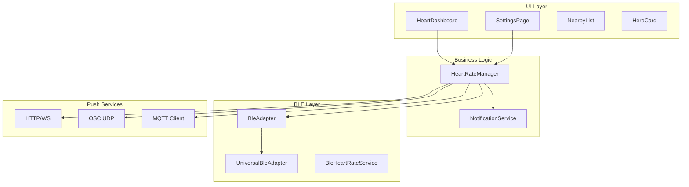
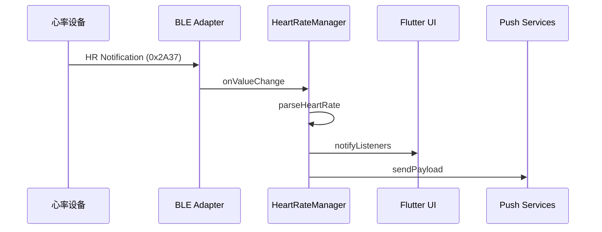
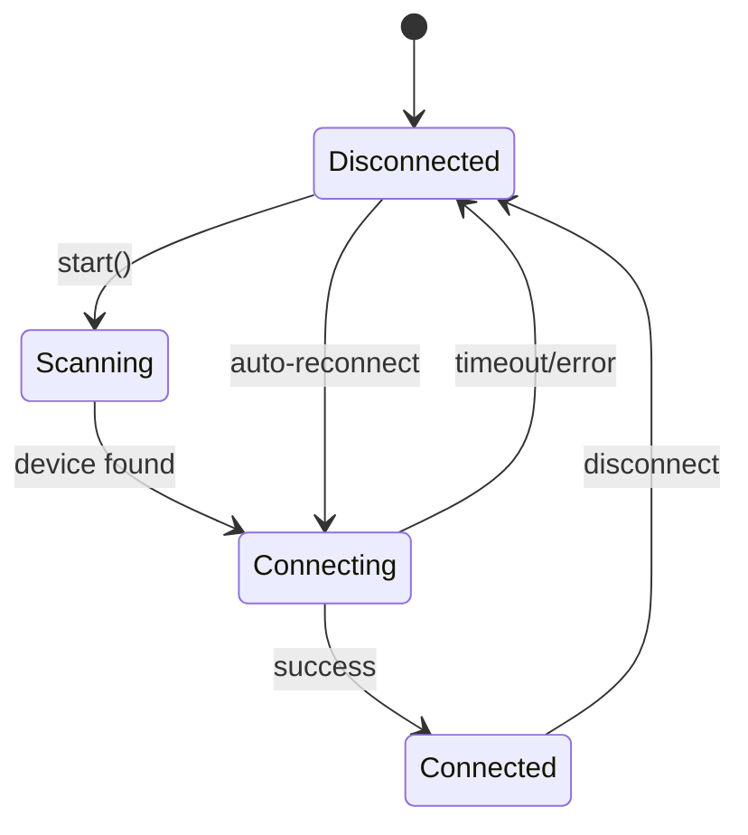

# HR PUSH 架构文档

本文档描述 HR PUSH 的技术架构和模块设计。

## 架构概览



## 核心模块

### HeartRateManager
**文件**: `lib/heart_rate_manager.dart`

中心状态管理器，继承自 `ChangeNotifier`，负责：
- BLE 设备扫描和连接
- 心率数据接收和处理
- 推送服务调度
- 连接状态管理和自动重连

### BLE 抽象层
**目录**: `lib/ble/`

| 文件 | 职责 |
| --- | --- |
| `ble_adapter.dart` | 抽象接口定义 |
| `universal_ble_adapter.dart` | 使用 `universal_ble` 的跨平台实现 |
| `ble_heart_rate_service.dart` | 心率服务封装 |

### 推送服务
内置于 `HeartRateManager`，支持：
- **HTTP/WebSocket**: 标准 REST/WS 推送
- **OSC**: VRChat 等应用的 UDP 协议
- **MQTT**: IoT 场景的消息队列

## 数据流



## BLE 连接状态机



## 目录结构

```
lib/
├── main.dart              # 应用入口
├── heart_rate_manager.dart # 核心状态管理
├── hr_notification_service.dart # Android 通知
├── app_log.dart           # 日志工具
├── ble/                   # BLE 抽象层
├── pages/                 # 页面
├── widgets/               # UI 组件
├── theme/                 # 设计系统
└── l10n/                  # 国际化
```

## 关键常量

| 常量 | 值 | 说明 |
| --- | --- | --- |
| Heart Rate Service UUID | `0x180D` | 标准 BLE 心率服务 |
| HR Measurement UUID | `0x2A37` | 心率测量特征 |
| 扫描间隔 | 1000ms | BLE 扫描周期 |
| 心率失效阈值 | 6s | 超时判定为离线 |
| 重连基础延迟 | 2s | 指数退避起始值 |
