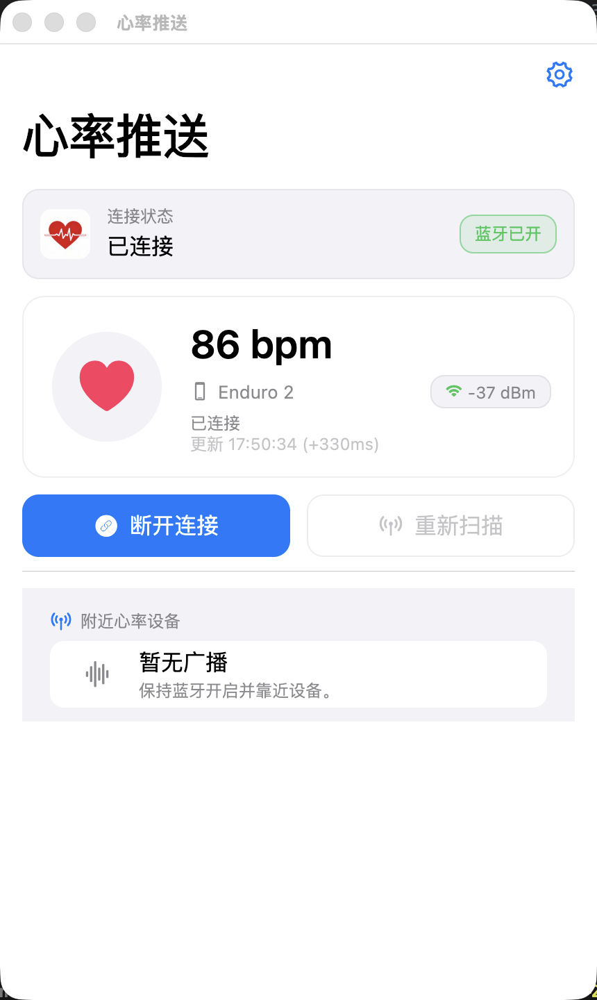
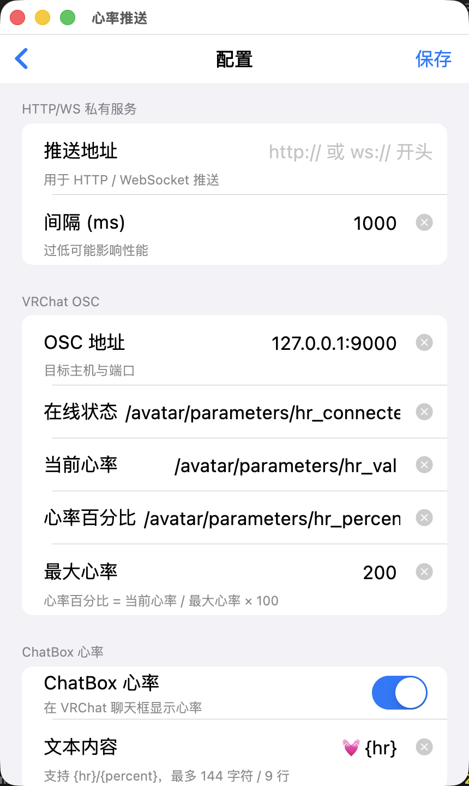
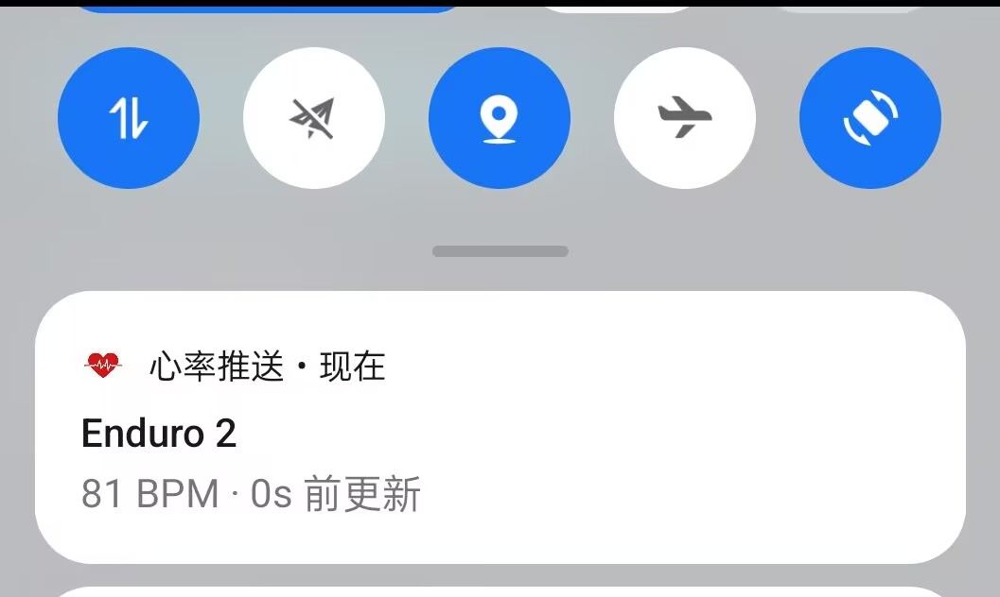

# HR OSC / 心率推送

一个用 Flutter 开发的跨平台 BLE 心率监控与推送工具。连接心率设备后，可将实时 BPM、在线状态与心率百分比同步到 **HTTP/WS、OSC、MQTT** 等链路，适用于直播、VRChat、舞台监测、运动记录等场景。

<div align="center">
  
</div>

## 目录
- [HR OSC / 心率推送](#hr-osc--心率推送)
  - [目录](#目录)
  - [效果预览](#效果预览)
  - [主要功能](#主要功能)
  - [快速开始](#快速开始)
  - [使用说明](#使用说明)
    - [连接/重连](#连接重连)
    - [推送数据格式](#推送数据格式)
    - [配置项](#配置项)
  - [VRChat（OSC）](#vrchatosc)
    - [测试截图](#测试截图)
      - [安卓设备状态栏](#安卓设备状态栏)
  - [设备兼容性](#设备兼容性)
    - [已验证设备](#已验证设备)
      - [蓝牙广播发送端](#蓝牙广播发送端)
      - [蓝牙广播接收端](#蓝牙广播接收端)
    - [已知不支持/限制](#已知不支持限制)
  - [已知问题](#已知问题)
  - [平台支持与权限](#平台支持与权限)
  - [开发与构建](#开发与构建)
  - [更新日志](#更新日志)
    - [v1.3.3](#v133)
    - [v1.3.1](#v131)
    - [v1.3.0](#v130)
    - [v1.2.2](#v122)
    - [v1.2.1](#v121)
    - [v1.2.0](#v120)
  - [贡献与反馈](#贡献与反馈)

## 效果预览

| 首页 | 配置页 |
| --- | --- |
|  |  |

## 主要功能
- **BLE 扫描与连接**：自动过滤无关广播，优先匹配心率服务/常见穿戴品牌；支持快速连接。
- **智能自动重连**：记忆最近成功设备；断连或心率长时间无更新时自动重连并避免并发死锁。
- **实时展示**：BPM、上次更新时间、RSSI 信号强度；RSSI 轮询间隔与“推送/刷新间隔”一致。
- **多协议推送（按需启用）**
  - **HTTP/WS**：填写 `http(s)://` 或 `ws(s)://` 地址后启用，发送 JSON。
  - **OSC**：填写 `host:port` 后启用（留空关闭）；UI 会预填推荐 `127.0.0.1:9000`。
  - **MQTT**：填写 Broker 地址后启用（留空关闭）；支持端口/Topic/用户名/密码/Client ID。
- **调试视图**：查看附近广播、Service UUID、RSSI、厂商数据长度，便于排查配对。
- **桌面端体验**：Windows/macOS/Linux 固定竖屏窗口；Windows 支持托盘最小化。
- **Android 常驻通知卡片**：连接后在通知栏显示当前心率并按刷新间隔更新。

## 快速开始
1. 安装 Flutter（>= 3.10 / Dart >= 3.10），并启用目标平台（如桌面端需 `flutter config --enable-windows-desktop`）。
2. 获取依赖：`flutter pub get`。
3. 运行应用：
   - Android/iOS：`flutter run -d <device>`
   - Desktop：`flutter run -d windows|macos|linux`
4. 打开应用 → 点击“重新扫描” → 选择心率设备连接。

## 使用说明
### 连接/重连
- “重新扫描”会刷新附近心率设备列表。
- “快速连接”会优先连接 RSSI 更好/最近出现的设备。
- 连接后若心率超过两倍失效阈值未更新，会判定掉线并自动重连。

### 推送数据格式
所有协议发送相同的 JSON payload。

- 心率事件
```json
{
  "event": "heartRate",
  "heartRate": 85,
  "percent": 0.42,
  "connected": true,
  "device": "Polar H10",
  "timestamp": "2025-12-12T09:00:00.000Z"
}
```

- 连接事件
```json
{
  "event": "connection",
  "connected": false,
  "device": "Polar H10",
  "timestamp": "2025-12-12T09:05:00.000Z"
}
```

`percent = heartRate / 最大心率`，范围 0~1。

### 配置项
| 配置项 | 说明 | 默认 |
| --- | --- | --- |
| HTTP/WS 推送地址 | 为空关闭；支持 `http(s)`/`ws(s)` | 空 |
| OSC 目标地址 | `host:port`；为空关闭；UI 预填推荐值 | 空（推荐 `127.0.0.1:9000`） |
| OSC 路径：在线状态 | 发送 bool | `/avatar/parameters/hr_connected` |
| OSC 路径：当前心率 | 发送 int BPM | `/avatar/parameters/hr_val` |
| OSC 路径：心率百分比 | 发送 float 0~1 | `/avatar/parameters/hr_percent` |
| MQTT Broker | 为空关闭；可写 `mqtt://host:port` 或纯 host | 空 |
| MQTT 端口 | Broker 未包含端口时生效 | `1883` |
| MQTT Topic | 发布 JSON payload | `hr_push` |
| MQTT 用户名/密码 | 可选 | 空 |
| MQTT Client ID | 为空自动生成 | 空 |
| 最大心率 | 用于计算百分比 | `200` |
| 推送/刷新间隔 (ms) | 控制 UI 刷新、推送节流、RSSI 轮询 | `1000` |

> 若设备仅广播心率不支持连接，仍可在“广播调试”视图中查看数据与信号，但推送仅在连接并订阅特征后触发。

## VRChat（OSC）
- 推荐搭配默认 OSC 参数插件：[booth.pm/zh-cn/items/5531594](https://booth.pm/zh-cn/items/5531594)
- 也可在 Avatar 参数中自行监听上述 OSC 路径。

### 测试截图


#### 安卓设备状态栏


## 设备兼容性
### 已验证设备
#### 蓝牙广播发送端
1. Garmin Enduro 2（佳明手表，蓝牙广播推送）

#### 蓝牙广播接收端
1. iPhone15 Pro（无证书可自行签名）
2. OnePlus Ace（ColorOS/Android 14）
3. MacBook Pro M5（macOS Tahoe 26.1）
4. Windows（B450I GAMING PLUS AC 主板，自带蓝牙）

### 已知不支持/限制
- **Mi Smart Band 系列**：设备通常不公开标准 BLE Heart Rate Service，且心率读取依赖厂商私有协议与鉴权（如配对密钥/握手），因此无法通过通用 BLE 心率特征直接接入本项目。


## 已知问题
在 Windows 平台下中文路径可能会存在运行失败的问题，建议在英文路径目录下执行本程序。

## 平台支持与权限
- Android：需要 BLE 扫描/连接权限（Android 12+ 无需定位，11 及以下需定位权限）。Android 13+ 若想显示常驻通知卡片，请允许通知权限。
  - ColorOS/部分国产 ROM：需在系统设置中打开应用通知，并允许后台运行/自启动，否则可能看不到常驻卡片或后台停止更新。
- iOS/macOS：首次启动会请求蓝牙权限。

## 开发与构建
- 主要代码：`lib/main.dart`（UI 与交互）、`lib/heart_rate_manager.dart`（扫描、连接、心率订阅与推送）。
- 代码风格：2 空格缩进；`dart format .`；启用 `flutter_lints`。
- 测试：`flutter test`。
- 打包：`flutter build apk|ios|windows|macos|linux`。

## 更新日志
### v1.3.3
- UI：应用标题统一为“心率推送”（桌面窗口、应用标题、iOS 显示名、测试文案）。
- UI：主页/配置页布局调整，设置按钮与保存按钮样式统一。
- OSC：推送心率时强制同步在线状态，避免状态滞后。
- Android：常驻通知通道更新，避免旧通道冲突。
- CI：Release 流程移除未签名 iOS 打包步骤。
- Release：发布包命名统一为 `hr-push` 前缀（macOS/Windows）。
- 文档：新增/更新 VRChat 与安卓截图、补充已测试设备清单与 Windows 中文路径已知问题说明。
- 资源：替换主界面/配置页/VRChat 截图。
- 开发：忽略 `.vscode/settings.json`，测试用例标题同步新名称。

### v1.3.1
- Windows：最小化到托盘后支持点击托盘图标恢复窗口。
- Windows：掉线后自动重连更稳定（扫描卡死自愈、广播心率候选识别增强、陈旧连接句柄清理）。
- UI：减少无关重建，整体交互更流畅。
- OSC：`/avatar/parameters/hr_connected` 更贴合实际在线状态（抗抖动与掉线恢复）。

### v1.3.0
- 新增 MQTT 推送（Broker 填写即启用，端口/Topic/鉴权可配）。
- Android 新增通知栏常驻心率卡片，并自动按刷新间隔更新。
- RSSI 轮询刷新间隔与配置一致，连接后持续刷新信号。
- 自动重连逻辑与按钮状态修复，避免重连死锁和重复连接。
- Windows：BLEServer 在中文用户名/路径下运行更稳定（Public ASCII 临时目录 + 正确工作目录）。

### v1.2.2
- Windows：最小化自动隐藏到系统托盘，悬停显示在线状态与心率摘要。
- Android：发布构建启用 R8 混淆、资源压缩与 ABI 分包；Windows/macOS/iOS 开启链接优化以减小体积。

### v1.2.1
- Windows：BLE 连接在数据长时间未更新时会主动重连，提升掉线恢复成功率。

### v1.2.0
- Windows/macOS/Android/iOS 统一使用 `images/logo.png` 生成应用图标。
- Windows：最小化/失焦时暂停心跳动画，降低 GPU 占用；检测心率数据长时间未更新时主动重连。
- README 补充中文路径构建提示。
- 依赖配置同步：`flutter_launcher_icons` 扩展桌面平台支持。

## 贡献与反馈
欢迎提交 Issue / PR，一起完善 BLE 兼容性与推送链路。若在特定设备或平台遇到问题，请附上日志与环境信息，便于复现。
