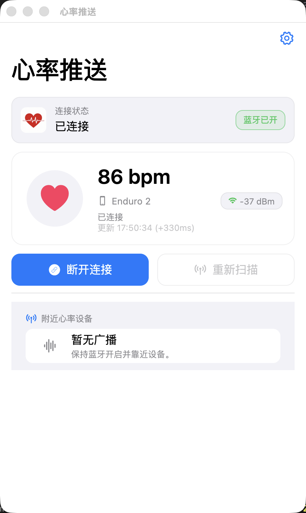
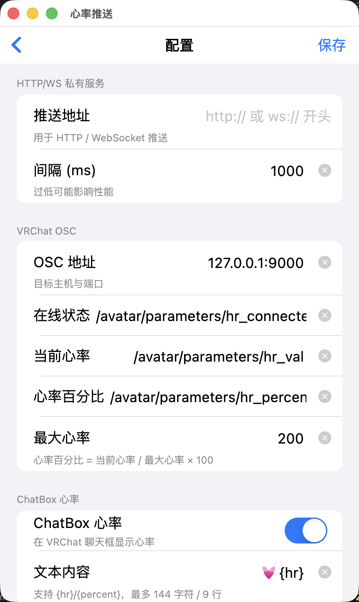
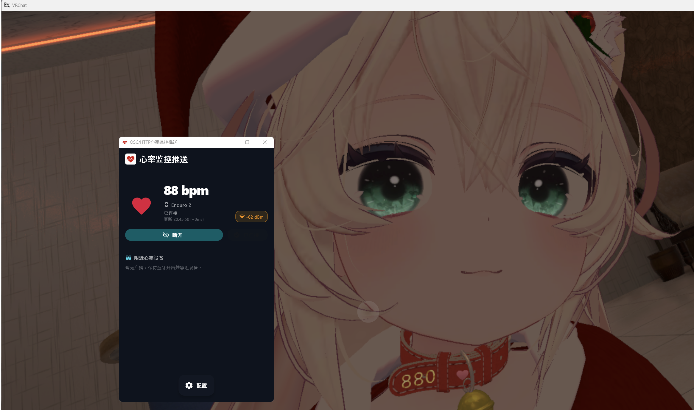
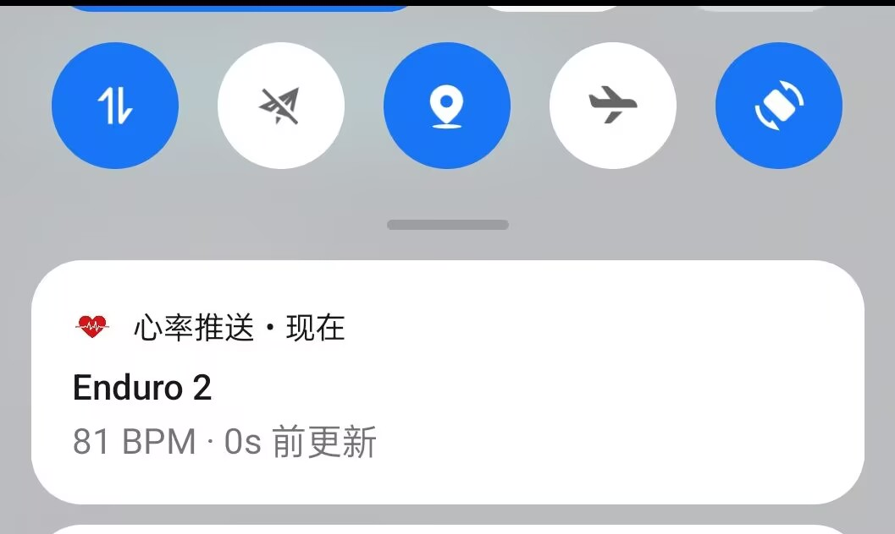

<div align="center">


# HR PUSH · 心率推送

**开源 · 跨平台 · 本地优先的 BLE 心率监控与多协议实时推送**

[](https://github.com/Ero-Cat/hr_push/releases)
[](https://github.com/Ero-Cat/hr_push/actions/workflows/ci.yml)
[](LICENSE)
[](CHANGELOG.md)
[](https://flutter.dev)
[](#-安装)
[](#-协议与数据格式)
[](test)

**中文** | [English](README_EN.md) | [日本語](README_JA.md)

</div>

HR PUSH 连接标准 BLE 心率设备（手表 / 手环 / 心率带），把实时 BPM、在线状态与心率百分比推送到 **HTTP/WS、OSC、MQTT** 任意组合的端点 —— 用于 [VRChat](#-vrchat-osc-联动) 联动、直播画面、Home Assistant 仪表盘，或你自己的任何程序。

一句话概括：**一台装上即忘的后台心率网关** —— 回到蓝牙范围自动连接，掉线自动重连，推送永不间断。

## 📖 目录

- [为什么再造一个](#-为什么再造一个)
- [功能特性](#-功能特性)
- [效果预览](#-效果预览)
- [快速开始](#-快速开始)
- [安装](#-安装)
- [使用手册](#-使用手册)
  - [连接心率设备](#-连接心率设备)
  - [配置推送](#-配置推送)
  - [VRChat（OSC）联动](#-vrchat-osc-联动)
  - [Android 常驻通知](#-android-常驻通知)
  - [iOS 实时活动](#-ios-实时活动)
  - [桌面后台运行](#-桌面后台运行)
- [协议与数据格式](#-协议与数据格式)
- [配置项参考](#-配置项参考)
- [设备兼容性](#-设备兼容性)
- [常见问题](#-常见问题-faq)
- [开发指南](#-开发指南)
- [更新日志](#-更新日志)

## 💡 为什么再造一个

心率推送工具并不少，但它们各有取舍：云端 SaaS 方案要注册账号、心率数据绕服务器一圈，部分功能还收订阅费；单平台小工具往往只支持 Windows 或只支持一种协议；直播软件插件则绑定特定 OBS 版本。

HR PUSH 想做的事很简单 —— **把心率稳定地送到你想送的任何地方**：

1. **本地优先**：数据从手表直达你的局域网端点，不经任何云端、不需要账号，断网也能推。
2. **一套代码五个平台**：Android / iOS / macOS / Windows / Linux 统一体验，手机和桌面主机都能当网关。
3. **多协议同发**：HTTP/WS + OSC + MQTT 任意组合同时启用，共享同一份 JSON payload，慢端点不阻塞快端点。
4. **装上即忘**：自动扫描、指数退避重连、无数据僵尸连接自愈、Android 常驻通知 / Windows 托盘后台运行。
5. **免费开源**：MIT 协议，无广告、无内购、无遥测。

> 🗺️ **典型场景**：家里有一台不关机的 Mac mini 或 Windows 主机，手表常开心率广播 —— 回到范围内即自动连接并持续推送；或把手机揣兜里，通过 OSC 驱动 VRChat 头像的实时心率动画。

## ✨ 功能特性

### 🔵 BLE 连接
- **智能扫描**：自动过滤无关广播，优先匹配心率服务（0x180D）与常见穿戴品牌（含小米手环 10、Redmi Watch 系列）。
- **自动重连**：记忆最近成功设备；断连或心率长时间无更新时按指数退避重连，连续失败自动停止，避免连接风暴；小米轮换 MAC 可按名称重连。
- **调试视图**：查看附近广播、Service UUID、RSSI 信号强度与厂商数据，排查设备问题不求人。

### 📤 多协议推送
- **HTTP**：POST JSON，3 秒超时，持久连接复用。
- **WebSocket**：断开后按指数退避自动重连（1~30 秒）。
- **OSC**：UDP 发送 bool / int / float 参数，支持 VRChat ChatBox 文本模板（UTF-8，中文 / emoji 无乱码）。
- **MQTT**：端口 / Topic / 用户名密码 / Client ID / TLS (mqtts) / 遗嘱消息 (LWT) 全可配，QoS 1 发布。
- **一键测试连接**：配置页内直接验证每个端点是否可达，不用反复保存试错。

### 🪟 各平台体验
- **Android**：原生「实时活动」风格常驻通知卡片，锁屏可见实时心率。
- **iOS**：实时活动（Live Activities）—— 锁屏与灵动岛显示实时心率（iOS 16.1+）。
- **Windows**：关闭最小化到系统托盘，后台继续推送，悬停查看心率摘要。
- **桌面端**：Windows / macOS / Linux 固定竖屏窗口，适配手机风格布局。

### 🧩 配置体验
- 首次使用向导、按协议分组折叠、全字段行内校验与错误提示、未保存离开确认。
- 中 / 英 / 日三语界面，状态文案全面本地化。

## 📷 效果预览

| 主界面 | 配置页 |
| :---: | :---: |
|  |  |

| VRChat OSC 联动 | Android 常驻通知 |
| :---: | :---: |
|  |  |

## 🚀 快速开始

1. 从 [Releases](https://github.com/Ero-Cat/hr_push/releases/latest) 下载并安装对应平台的安装包（见下方[安装](#-安装)）。
2. 启动应用，点击 **重新扫描**，选择心率设备并连接。
3. 进入配置页填写推送目标（HTTP/WS、OSC 或 MQTT），保存后即开始推送。

> 💡 若设备仅广播心率但不支持连接，仍可在「广播调试」视图中查看数据与信号，但推送仅在连接并订阅心率特征后触发。

## 📥 安装

### 从 Release 下载（推荐）

前往 [GitHub Releases](https://github.com/Ero-Cat/hr_push/releases/latest) 下载最新版本（`vX.Y.Z` 为版本号）：

| 平台 | 下载文件 | 说明 |
| --- | --- | --- |
| Android | `app-release-vX.Y.Z.apk` | 直接安装；首次使用需授予蓝牙与通知权限 |
| Windows | `hr-push-windows-vX.Y.Z.zip` | 解压后运行；需支持 BLE 的蓝牙适配器；⚠️ 暂不支持中文路径 |
| macOS | `hr-push-macos-vX.Y.Z.zip` | 解压得到 `.app`；首次打开若提示未知开发者，请右键 → 打开 |
| iOS / Linux | 需自行构建 | iOS 需 Apple 开发者账号签名；Linux 需系统安装 `bluez` |

### 从源码构建

前置要求：[Flutter SDK](https://docs.flutter.dev/get-started/install) ≥ 3.11（Windows 另需 Visual Studio C++ 工作负载，macOS/iOS 需 Xcode）。

```bash
git clone https://github.com/Ero-Cat/hr_push.git
cd hr_push
flutter pub get
flutter run -d <device>          # 运行
flutter build apk                # Android APK
flutter build windows            # Windows（也可 build macos / linux / ios）
```

## 📖 使用手册

### 🔵 连接心率设备

1. 启动应用后点击 **重新扫描**（已自动过滤无关广播，优先显示心率设备）。
2. 点击设备连接，首页即可看到实时 BPM、上次更新时间与 RSSI 信号强度。
3. 掉线后无需干预：应用会自动重连最近成功的设备；手表远离后再回来，推送自动恢复。

小米 / Redmi 手表手环需要先在手表端开启「心率广播」，详见[设备兼容性](#-设备兼容性)。

### 📤 配置推送

1. 进入 **配置页**，按需填写任意组合的推送端点：
   - **HTTP/WS**：填 `http(s)://` 或 `ws(s)://` 地址，为空即关闭该协议；
   - **OSC**：填 `host:port`（VRChat 默认 `127.0.0.1:9000`）；
   - **MQTT**：填 Broker 地址，可选端口 / Topic / 用户名密码 / TLS / 遗嘱主题。
2. 点击各协议的 **测试连接** 按钮验证端点可达。
3. 保存后立即生效，无需重启应用。所有协议发送相同的 [JSON payload](#-协议与数据格式)。

完整字段说明见[配置项参考](#-配置项参考)。

### 🎮 VRChat OSC 联动

在 VRChat 中通过 OSC 参数驱动头像动画：

1. 配置页填入 OSC 目标 `127.0.0.1:9000`（VRChat 默认 OSC 端口，需在 VRChat 设置中开启 OSC）。
2. Avatar 参数中监听以下地址（也可直接使用推荐插件 [booth.pm/zh-cn/items/5531594](https://booth.pm/zh-cn/items/5531594)）：
   - `/avatar/parameters/hr_connected` — bool，设备是否在线
   - `/avatar/parameters/hr_val` — int，当前 BPM
   - `/avatar/parameters/hr_percent` — float 0~1，心率百分比
3. 可选：开启 **ChatBox 推送**，用模板（如 `💓{hr}`）把心率文本发到 `/chatbox/input`，支持 `{hr}` / `{percent}` 占位符，自带节流与去重防刷屏。

### 📱 Android 常驻通知

连接成功后自动显示「实时活动」风格常驻通知卡片，按推送间隔实时刷新心率，锁屏可见。若不显示：

- 授予应用 **通知权限**；
- ColorOS / MIUI / HyperOS 等定制系统需在设置中允许 **后台运行** 与 **自启动**。

### 📲 iOS 实时活动

iOS 16.1+ 连接成功后自动开启实时活动，锁屏与灵动岛实时显示心率，无需任何配置。

### 💻 桌面后台运行

- **Windows**：点击关闭按钮即最小化到系统托盘，后台继续扫描重连与推送；点击托盘图标恢复窗口，悬停查看在线状态与心率摘要。
- **macOS / Linux / Windows**：均为固定竖屏窗口，与手机端布局一致。

## 🔗 协议与数据格式

所有协议发送相同的 JSON payload：

- 心率事件

```json
{
  "event": "heartRate",
  "heartRate": 85,
  "heart_rate": 85,
  "percent": 0.42,
  "connected": true,
  "device": "Polar H10",
  "timestamp": "2025-12-25T09:00:00.000Z"
}
```

- 连接事件

```json
{
  "event": "connection",
  "connected": false,
  "device": "Polar H10",
  "timestamp": "2025-12-25T09:05:00.000Z"
}
```

说明：

- `percent = heartRate / 最大心率`，范围 0~1（最大心率默认 200，可在配置页修改）。
- 心率事件同时包含 `heartRate` 与 `heart_rate` 两个键（值相同）：前者与本文档一致，后者为历史版本兼容键，便于既有 webhook 无缝迁移。
- HTTP 为 POST（超时 3 秒）；WebSocket 发送 JSON 文本；MQTT 以 QoS 1 发布到配置的 Topic；OSC 发送单独的参数地址（见上方 VRChat 一节）。

## 🔧 配置项参考

| 配置项 | 说明 | 默认 |
| --- | --- | --- |
| HTTP/WS 推送地址 | 为空关闭；支持 `http(s)`/`ws(s)` | 空 |
| OSC 目标地址 | `host:port`；为空关闭；UI 预填推荐值 | 空（推荐 `127.0.0.1:9000`） |
| OSC 路径：在线状态 | 发送 bool | `/avatar/parameters/hr_connected` |
| OSC 路径：当前心率 | 发送 int BPM | `/avatar/parameters/hr_val` |
| OSC 路径：心率百分比 | 发送 float 0~1 | `/avatar/parameters/hr_percent` |
| OSC ChatBox 开关 | 开启后向 `/chatbox/input` 推送心率文本 | 关闭 |
| OSC ChatBox 文本 | 支持 `{hr}`/`{percent}`；最多 144 字符 / 9 行 | `💓{hr}` |
| MQTT Broker | 为空关闭；可写 `mqtt://host:port` 或纯 host | 空 |
| MQTT 端口 | Broker 未包含端口时生效 | `1883` |
| MQTT Topic | 发布 JSON payload | `hr_push` |
| MQTT 用户名/密码 | 可选 | 空 |
| MQTT Client ID | 为空使用默认 ID | 空 |
| MQTT TLS | 启用 mqtts（常用端口 8883） | 关闭 |
| MQTT 遗嘱主题 | 异常断开时发布离线消息（可选） | 空 |
| 最大心率 | 用于计算百分比 | `200` |
| 推送/刷新间隔 (ms) | 控制 UI 刷新、推送节流、RSSI 轮询 | `1000` |

## 🧩 设备兼容性

只要实现标准 BLE 心率服务（0x180D）的设备即可连接。以下为已验证型号：

**蓝牙广播发送端（手表 / 手环 / 心率带）**
1. Garmin Enduro 2（佳明手表，蓝牙广播推送）
2. Xiaomi Smart Band 10 / 9、Redmi Watch 系列（需在手表端开启「心率广播」，见下方说明）
3. HuaWei Watch GT 4
4. Apple Watch（需配合第三方 App，见下方说明）

**蓝牙广播接收端（运行 HR PUSH 的设备）**
1. iPhone 15 Pro（无证书可自行签名）
2. OnePlus Ace / ColorOS 14（Android 14）
3. MacBook Pro M5（macOS Tahoe 26.1）
4. Windows（蓝牙适配器需支持 BLE）

### 🔴 小米 / Redmi 手表手环（重要）

小米与 Redmi 手表默认使用小米私有 BLE 协议（需服务器配对），**不会**对外提供标准心率服务。要在 HR PUSH 中使用，请在手表端开启「心率广播」：

1. 手表进入 **设置 → 心率**，开启 **心率广播**（部分型号叫「分享心率」）。
2. 确认手表没有被「小米运动健康」App 占用连接（BLE 单连接限制）。
3. 回到 HR PUSH 重新扫描，连接设备即可。

开启后手表会以标准心率服务（0x180D）广播并可连接，无需任何配对。若连接后提示未找到心率服务，应用会弹出上述引导。

### ⌚ Apple Watch 准备工作

> ⚠️ **重要提示：** Apple Watch **不原生支持**标准 BLE 心率广播协议。你需要安装第三方 App 将心率数据转发为标准 BLE 信号后，HR PUSH 才能接收。

**为什么需要第三方 App？** HR PUSH 通过标准 BLE 心率服务（UUID: `0x180D`）接收心率数据。Apple Watch 默认不广播此服务，而是将心率数据保留在 Apple HealthKit 生态内，因此需要借助第三方 App 转发。

**推荐方案：HeartCast（免费）** —— 可将 Apple Watch 心率通过 iPhone 以标准 BLE 心率服务广播出去：

1. 在 iPhone 和 Apple Watch 上安装 [HeartCast](https://apps.apple.com/app/heartcast-heart-rate-monitor/id1499771124)。
2. 确保 iPhone 和 Apple Watch 已配对并正常连接。
3. 在 Apple Watch 上打开 HeartCast，点击 **Start** 开始广播。
4. 在运行 HR PUSH 的设备上点击「重新扫描」。
5. 在设备列表中找到类似 `HeartCast` 或 `iPhone (xxx)` 的设备并连接。

注意事项：HeartCast 通过 iPhone 中转广播，HR PUSH 实际连接的是 iPhone；需保持 HeartCast 在 Apple Watch 前台运行或开启后台模式；iPhone 需开启蓝牙并与接收端在同一范围内。

其他可选方案：

| 应用 | 类型 | 说明 |
| --- | --- | --- |
| [ECHO BLE](https://apps.apple.com/app/echo-ble/id1572440703) | 免费 | 功能与 HeartCast 类似 |
| [WATCH LINK](https://apps.apple.com/app/watch-link/id1565977702) | 付费（需硬件） | 需配合 WATCH LINK Pod/USB 硬件，支持 ANT+ 和 BLE |

### 🔐 平台权限

- **Android**：需 BLE 扫描/连接权限（Android 12+ 无需定位，11 及以下需定位权限）；显示状态栏卡片需通知权限。
- **iOS / macOS**：首次启动会请求蓝牙权限。
- **Linux**：需系统安装 `bluez`。

## ❓ 常见问题 FAQ

<details>
<summary><b>扫描不到我的手表/手环？</b></summary>

- 小米 / Redmi 设备默认使用私有协议，需先在手表端开启「心率广播」，见[设备兼容性](#-设备兼容性)。
- 确认手表没有被厂商 App（如「小米运动健康」）占用连接 —— BLE 为单连接。
- iOS / macOS 首次使用需在系统弹窗中允许蓝牙权限；Android 11 及以下需授予定位权限。
</details>

<details>
<summary><b>Apple Watch 能直接连接吗？</b></summary>

不能。Apple Watch 不广播标准 BLE 心率服务，需配合 HeartCast 等第三方 App 转发，详见[Apple Watch 准备工作](#-apple-watch-准备工作)。
</details>

<details>
<summary><b>推送目标收不到数据？</b></summary>

- 确认设备已**连接并订阅**心率特征 —— 推送仅在连接成功后触发，仅广播不连接不会推送。
- 在配置页使用「测试连接」按钮逐一验证端点可达。
- 检查防火墙 / 端口：OSC 走 UDP，MQTT / HTTP 走 TCP，确认端口未被拦截。
- 推送按「推送/刷新间隔」节流（默认 1000ms），数据不变时会去重。
</details>

<details>
<summary><b>Android 常驻通知不显示 / 后台停止更新？</b></summary>

授予通知权限后重新连接；ColorOS / MIUI / HyperOS 等定制系统还需在设置中允许本应用「后台运行」与「自启动」。
</details>

<details>
<summary><b>VRChat ChatBox 中文 / emoji 乱码？</b></summary>

已在 v1.7.2 修复（OSC 文本改为 UTF-8 编码），请升级到最新版本。
</details>

<details>
<summary><b>VRChat 里 OSC 参数有延迟或不刷新？</b></summary>

确认 VRChat 设置中已开启 OSC；推送节奏与「推送/刷新间隔」一致；若本机显示与 VRChat 不同步，升级到 v1.7.2+（UI 显示已与推送快照同步）。
</details>

<details>
<summary><b>Windows 下程序无法启动或闪退？</b></summary>

已知问题：Windows 平台下中文路径可能导致运行失败，请将程序放在英文路径目录中运行。另请确认蓝牙适配器支持 BLE。
</details>

<details>
<summary><b><code>percent</code> 是怎么计算的？</b></summary>

`percent = heartRate / 最大心率`，范围 0~1。最大心率默认 200，可在配置页按自身情况调整。
</details>

## 🧰 开发指南

```bash
flutter pub get       # 安装依赖
flutter run           # 运行
flutter test          # 运行测试（51 项）
flutter analyze       # 静态分析
dart format .         # 格式化
flutter gen-l10n      # 生成中/英/日本地化文件
```

- 架构说明见 [ARCHITECTURE.md](ARCHITECTURE.md)，贡献指南见 [CONTRIBUTING.md](CONTRIBUTING.md)。
- 主要模块：`lib/heart_rate_manager.dart`（BLE / 重连 / 推送调度核心）、`lib/ble/`（平台无关 BLE 抽象层）、`lib/services/`（OSC / MQTT / HTTP-WS 推送服务）。
- 代码风格：2 空格缩进，启用 `flutter_lints`。

## 🧾 更新日志

**v1.8.0** — Redmi/小米手表兼容性（重连风暴治理、心率广播引导）、设置页全面重构（分组折叠 / 行内校验 / 一键测试连接）、MQTT TLS 与遗嘱消息、HTTP 持久连接与协议并行扇出、iOS 实时活动、Windows 托盘后台运行。

完整历史版本见 [CHANGELOG.md](CHANGELOG.md)。

## 🤝 贡献与反馈

欢迎提交 Issue / PR，一起完善 BLE 兼容性与推送链路。若在特定设备或平台遇到问题，请附上日志与环境信息，便于复现。

## 📜 开源协议

本项目采用 [MIT License](LICENSE)。

## 🌐 多语言 README

- English: [README_EN.md](README_EN.md)
- 日本語: [README_JA.md](README_JA.md)
